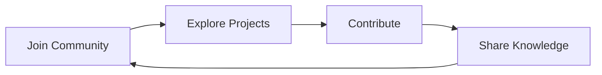

# 🚀 Scripters Collective 一 Free & Open Source


[](https://t.me/ScriptersCollective)

<div align="center">
  

  <h3>「 Empowering Developers Through Free Resources & Open Innovation 」</h3>
</div>

## 🌟 About Us

Welcome to **Scripters Collective** - where innovation meets community! We're a global developer collective focused on:

- 🛠️ Creating free, open-source development tools
- 💡 Building innovative blockchain solutions
- 🤝 Fostering global tech collaboration
- 📚 Sharing knowledge and resources
- 🌍 Building a worldwide developer ecosystem

## ⚡ Featured Projects

### Flash USDT Demo
[](https://youtu.be/BG7BES0pa34?si=Thvr_40cu7uVpWo_)

```javascript
// Experience the future of blockchain interaction
const flashUSDT = {
  type: "Demo Project",
  purpose: "Educational & Entertainment",
  blockchain: "Multi-chain Compatible"
};
```

🔗 [Explore Flash USDT Repository](https://github.com/FlashUSDTSenderBot/flashusdtsenderbot.github.io)

## 🛠️ Technology Stack

<div align="center">


</div>

## 🤝 Join Our Community

We believe in the power of community-driven development. Here's how you can get involved:



### Connect With Us

- 📱 **Telegram**: [@ScriptersCollective](https://t.me/ScriptersCollective)
- 💻 **GitHub**: [github.com/ScriptersCollective](https://github.com/ScriptersCollective)
- 🌐 **Website**: [scripterscollective.org](https://scripterscollective.org)
- 📧 **Email**: contact@scripterscollective.org

## 📍 Location

<div align="center">

🌍 **Based in Bahrain** | 🌐 **Operating Globally**

</div>

## 🤖 Latest Activity

<!-- ACTIVITY-LIST:START -->
- 🚀 New repositories weekly
- 💡 Regular tech tutorials
- 🤝 Active community support
- 📚 Free resource sharing
<!-- ACTIVITY-LIST:END -->

## 📜 License

```
MIT License

Copyright (c) 2024 Scripters Collective

Permission is hereby granted, free of charge, to any person obtaining a copy
of this software and associated documentation files.
```

<div align="center">

---

### 🌟 Star us on GitHub to show your support! 🌟

[](https://github.com/ScriptersCollective)

</div>
