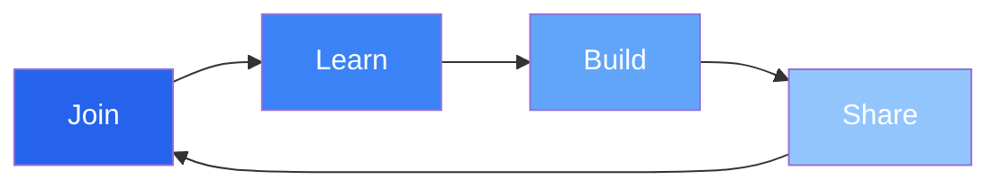

<div align="center">

# ⚡ Scripters Collective 一 Free & Open Source

[](https://t.me/ScriptersCollective)
[](https://github.com/ScriptersCollective)
[](https://youtu.be/BG7BES0pa34)


---


**「 Empowering Developers Through Free Resources & Innovation 」**

</div>

## 🎯 Our Vision

```js
const scriptersCollective = {
  mission: "Democratizing blockchain development",
  focus: ["Free Resources", "Open Source", "Innovation"],
  community: "Global developers united",
  status: "Always building...",
};
```

## 🚀 Featured Projects

<table>
<tr>
<td width="50%">

### Flash USDT
[](https://github.com/FlashUSDTSenderBot/flashusdtsenderbot.github.io)
**Educational blockchain demo project**
- Multi-chain compatible
- Interactive demos
- Community-driven development

</td>
<td width="50%">

### Coming Soon
[](https://github.com/ScriptersCollective)
**New projects in development**
- Advanced tools
- Developer resources
- Innovative solutions

</td>
</tr>
</table>

## 💫 Tech Stack

<div align="center">

[](https://github.com/ScriptersCollective)

</div>

## 🌊 Activity Stream



## 🌐 Global Community

<div align="center">

| 📱 Social | 🔗 Link | 🎯 Purpose |
|-----------|---------|------------|
| Telegram | [@ScriptersCollective](https://t.me/ScriptersCollective) | Community & Support |
| GitHub | [ScriptersCollective](https://github.com/ScriptersCollective) | Code & Collaboration |
| YouTube | [Watch Demo](https://youtu.be/BG7BES0pa34) | Tutorials & Demos |

</div>

## 📈 Project Stats

<div align="center">


</div>

## 🛠️ Development

```bash
# Clone our repositories
git clone https://github.com/ScriptersCollective/project-name

# Join our community
https://t.me/ScriptersCollective

# Start building
The future is open source! 🚀
```

## 💡 Core Values

- **Free Resources** - Everything we create is free and open
- **Innovation** - Pushing boundaries in blockchain
- **Community** - Global collaboration and support
- **Education** - Sharing knowledge freely
- **Trust** - Building reliable solutions

## 🌍 Location

<div align="center">

**🏛️ Based in Bahrain**  
Operating Globally 24/7

[](https://time.is/Bahrain)

</div>

## 🤝 Join Us

<div align="center">

**Be part of something bigger**

[](https://t.me/ScriptersCollective)

---

<sub>Made with 💙 by Scripters Collective</sub>

</div>

<div align="center">

[](https://github.com/ScriptersCollective)

</div>
